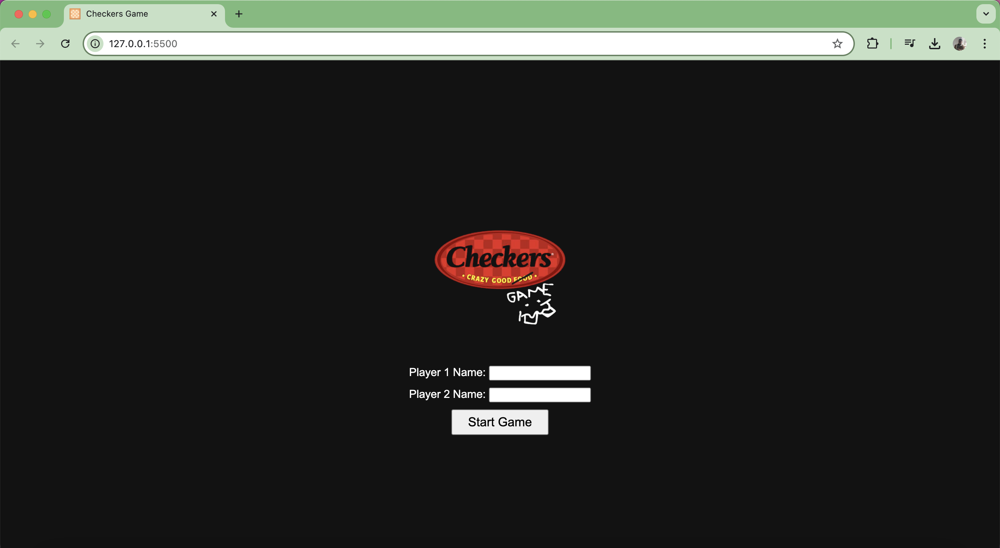

# Checkers Game

 

## Game's Name and Description
**Checkers Game**

This is a web-based Checkers game where two players can compete against each other. The game follows the traditional rules of Checkers, where the goal is to capture all of the opponent's pieces or block them so they cannot move.

### Why I Chose This Game
I chose to create a Checkers game because it is a classic and strategic board game that many people enjoy. It also provided a good challenge for implementing game logic and user interactions.

## Getting Started
To play the game, visit the following link:

### Instructions:
1. Enter the names of Player 1 and Player 2.
2. Click "Start Game" to begin. If you're unsure how to play there's a how to play button.
3. Players take turns moving their pieces diagonally.
4. Capture opponent pieces by jumping over them.
5. The game ends when one player captures all the opponent's pieces or blocks them from moving.

### Planning Materials:
- [Link to project-plan.md](https://github.com/Nottimlim/Checkers-Browser-Game/blob/main/Project-Plan.md)

## Attributions
- cobalt.tools
- https://www.flaticon.com/free-icons/checkers for checkers favicon
- https://www.w3schools.com/
for learning new methods and etc
- https://stackoverflow.com/ 
referencing scenarios and other peoples codes to learn and gain inspiration
## Technologies Used
- HTML
- CSS
- JavaScript

## Next Steps
Here are some planned future enhancements for the game:
- Implementing a single-player mode with AI.
- Adding more themes and customization options.
- Improving the user interface and animations for a more engaging experience.
- Adding sound effects for moves and captures.
- Implementing king function for pieces that reach the end of the board.
